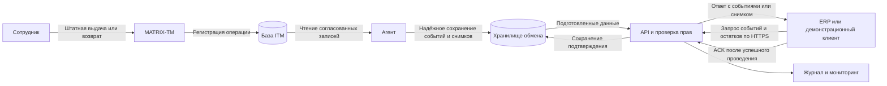
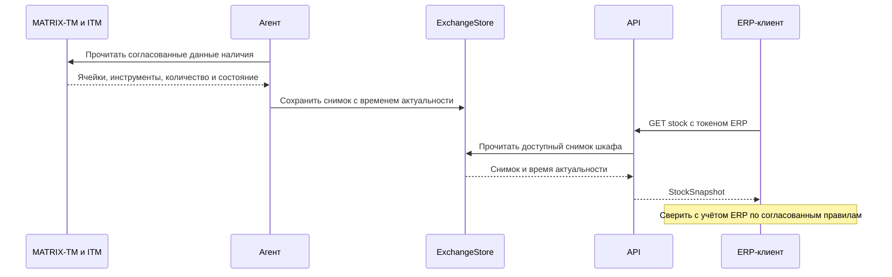
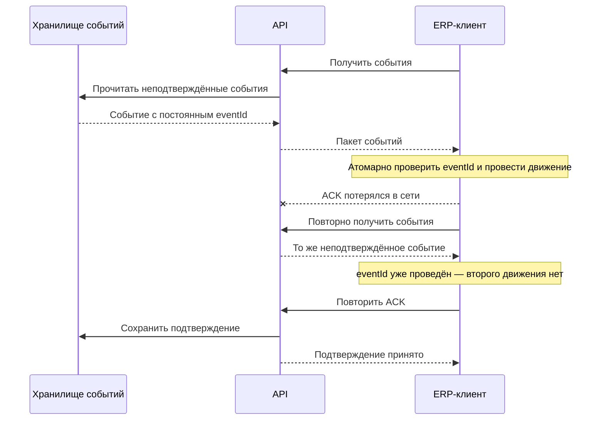

# Схема решения и план проверки

В этой редакции инициатор межсистемного обмена — ERP: она запрашивает события и фактические остатки, а система шкафа возвращает их через API. Агент шкафа не запрашивает остатки у ERP и не отправляет ей данные по собственной инициативе. Полная модель приведена в [сводном отчёте](08-report-erp-initiated-exchange.md).

Это предлагаемая схема будущего прототипа. Работающие компоненты и результаты испытаний пока отсутствуют.

## Схема для объяснения

Пояснение: слева создаётся факт операции, в центре он сохраняется, справа ERP запрашивает и учитывает его. Стрелка ACK означает подтверждение учёта. Команд открытия ячеек здесь нет.

## Запрос фактического остатка

Шкаф не запрашивает корпоративный остаток. Инициатор GET stock — ERP, а источник фактического наличия — MATRIX-TM. ACK применяется к событиям выдачи и возврата, а не к чтению снимка.

## Последовательность с потерей ACK

## Компоненты первого стенда

| Компонент | Функция | Что требуется уточнить |
|---|---|---|
| Имитатор источника ITM | Создаёт тестовые завершённые операции | Реальные поля и порядок фиксации ITM |
| Агент | Преобразует записи, сохраняет eventId, позицию чтения и снимки | Выбрано прямое внутреннее сохранение; способ чтения реальной ITM уточняется |
| ExchangeStore | Хранит события и подтверждения устойчиво | Транзакции, срок хранения и повторная выдача |
| API и AuthService | Выдают токен, события и остатки, принимают ACK | Единый контракт и права |
| Демонстрационный ERP-клиент | Сам инициирует опрос, проводит движения и подтверждает | Бизнес-правила целевой ERP |
| Журнал | Связывает события с запросами и ошибками | Безопасный состав записей |

Сначала достаточно одного шкафа, небольшого набора инструментов и одного клиента. Интерфейс оператора можно ограничить просмотром состояния и журнала. Масштабирование и расширенная отчётность не являются первым проверяемым результатом.

## Обязанности каждой стороны

Агент сохраняет один и тот же `eventId` при повторном чтении исходной записи. Checkpoint продвигается только после устойчивого сохранения. API не удаляет событие после GET. ERP атомарно фиксирует номер и движение, затем отправляет ACK. Сервер сохраняет повторный ACK без повторного изменения результата.

Это распределённый обмен, поэтому сервер не может сам проверить факт проводки в чужой ERP только по успешной передаче ответа. На стенде результат проверяется по её хранилищу движений.

## Контракт внешних маршрутов по таблице 4 ТЗ

| Маршрут | Назначение |
|---|---|
| `POST /api/v1/auth/token` | Получить токен сервисного клиента ERP |
| `GET /api/v1/cabinets/{cabinetId}/events` | Получить пакет событий |
| `POST /api/v1/cabinets/{cabinetId}/events/ack` | Подтвердить обработанные события |
| `GET /api/v1/cabinets/{cabinetId}/stock` | Получить снимок наличия по данным шкафа |
| `GET /api/v1/health` | Проверить готовность API без производственных данных |

Это обзор, а не завершённая OpenAPI-спецификация. До реализации согласовать поля пакета, `batchId`, поведение курсора, результат частичного ACK и источник снимка.

## Иллюстративный учётный пример

Начальное количество одного инструмента в демонстрационном шкафу — 10. Выдача 1 и возврат 1 дают движения −1 и +1 по месту хранения шкафа; конечное количество — 10. Это условный пример, а не данные предприятия. Общий остаток предприятия и ответственность сотрудника определяются отдельными правилами.

Если выдача доставлена дважды, в демонстрационном учёте должно остаться одно движение −1. Если ACK потерян, повторная выдача события не должна изменить результат.

## Сценарии будущей демонстрации

| № | Действие | Ожидаемый результат | Основание |
|---|---|---|---|
| 1 | Создать 10 корректных операций выдачи и возврата | 10 событий и соответствующие движения без повторного ручного ввода | § 2.1.1 |
| 2 | Повторить получение одного события до ACK | Тот же eventId; повторного движения нет | § 4.4.3 |
| 3 | Потерять ACK после проведения | Повторное получение безопасно; следующий ACK завершает обмен | Приложение З |
| 4 | Повторить успешно сохранённый ACK | Подтверждение безопасно, результат учёта не меняется | § 4.2.3 |
| 5 | Остановить опрос ERP, затем возобновить | События накапливаются и обрабатываются после восстановления | § 4.2.5 |
| 6 | Перезапустить агент и API до ACK | eventId и неподтверждённые записи сохраняются | § 4.4.3.1 |
| 7 | Сделать ExchangeStore недоступным | API сигнализирует отказ; агент сохраняет локально, не теряя позицию | § 4.1.1.1 |
| 8 | Передать неверный токен или запрос чужого шкафа | 401 или 403; производственные данные не выдаются | § 4.4.8 |
| 9 | Подтвердить часть пакета | Успешные отмечены; остальные доступны по согласованному пути повторной обработки | Уточнение к § 4.2.3 |
| 10 | Сверить исходную запись, событие и движение | Количество и номенклатура согласованы; история находится по eventId | § 2.1.3 |
| 11 | ERP-клиент запрашивает stock | API возвращает снимок по данным шкафа с временем актуальности; запросов Agent–ERP нет | § 4.2.4 |
| 12 | Передать неизвестное состояние ячейки | Ответ сохраняет признак неизвестности, не подменяет его нулевым наличием | § 4.2.4 |

Подмену содержимого при том же eventId проверять на внутренней регистрации события, где доступно тело сообщения. Во внешнем ACK тело исходной операции не передаётся, поэтому такой сценарий нельзя без уточнения объявлять проверкой маршрута ACK.

Нагрузочные требования 20 запросов/с в течение 30 минут и время ответа для 95 % запросов не более 2 секунд взяты из § 4.4.2. Сейчас это цели будущего испытания, а не измеренные показатели.

## Что показать завтра при отсутствии кода

Показать выбранный объект, схему процесса, пример потери ACK и таблицу будущих проверок. Прямо назвать их проектными материалами. На вопрос о практической части показать последовательность первого прототипа, а не выдавать схему за работающую систему.
