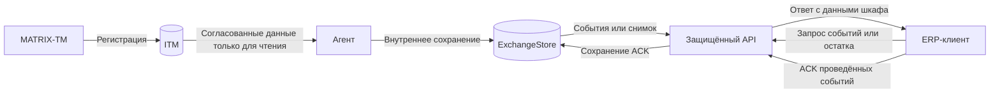

# Отчёт об автоматизации учёта инструмента при обмене по инициативе ERP

Редакция от 4 октября 2026 года. Проектная постановка по предоставленному ТЗ с исправленной логикой обмена. Сейчас имеется только ТЗ; реализация, доступ к реальному оборудованию и результаты испытаний отсутствуют.

## 1 Объект автоматизации и цель

Объект автоматизации — процесс регистрации и отражения выдачи и возврата инструмента в корпоративном учёте предприятия на участке, использующем инструментальный шкаф MATRIX-TM.

Цель — разработать и проверить интеграционную подсистему, которая предоставляет ERP зарегистрированные шкафом операции без повторного ручного ввода, сохраняет события при сбоях и позволяет предотвращать повторное проведение. Фактическое наличие инструмента предоставляется ERP для сверки с её учётными данными.

Рекомендуемая формулировка темы: «Автоматизация учёта движения инструмента на основе интеграции MATRIX-TM с ERP-системой предприятия». Изменение официальной темы требует согласования с руководителем.

## 2 Принцип взаимодействия

**Инициатор всех внешних бизнес-запросов к интеграционному API — ERP.** Система шкафа предоставляет события и снимки фактического наличия в ответ на эти запросы. Соединение из шкафа или интеграционного API к ERP не устанавливается.

Инициатор запроса и источник данных — разные роли. Запрос на получение остатков направлен от ERP к API; ответ с остатками направлен от системы шкафа к ERP. Поэтому формулировка «шкаф отдаёт остатки в ERP» в этой архитектуре означает предоставление данных в ответе, а не самостоятельную отправку шкафом.

Штатные операции сотрудника, внутреннее чтение ITM агентом и диагностические запросы мониторинга не относятся к внешнему бизнес-обмену ERP. Они не меняют выбранного распределения ролей.

Теоретически возможна другая архитектура, в которой шкаф инициирует отправку событий и остатков. Для неё потребовались бы отдельный принимающий интерфейс ERP и другие правила доставки и доступа. Такой вариант в настоящем отчёте не используется. Источником фактического наличия в любом случае остаётся шкаф.

## 3 Участники и ответственность

| Участник | Ответственность |
|---|---|
| Сотрудник | Выполняет штатную физическую выдачу или возврат |
| MATRIX-TM | Проверяет штатные права, управляет ячейками, регистрирует завершённую операцию и сведения о наличии |
| База ITM | Предоставляет согласованный источник операций и наличия |
| ToolCabinetAgent | Читает данные шкафа, нормализует их, устойчиво сохраняет события и снимки во внутреннем хранилище |
| ExchangeStore | Хранит события, снимки, позиции чтения и подтверждения |
| ToolCabinetApi | Принимает запросы ERP, проверяет доступ, возвращает данные, сохраняет ACK |
| AuthService | Проверяет сервисную учётную запись ERP и выдаёт её токен |
| Серверный адаптер | Сопоставляет идентификаторы и формирует согласованные модели ответа; не подключается к ERP |
| ERP и её интеграционный клиент | Инициируют обмен, проводят движения по правилам предприятия и подтверждают успешно обработанные события |
| Оператор и администратор | Контролируют состояние, разбирают исключения и поддерживают инфраструктуру |

## 4 Архитектура и направления потоков

| Функция | Инициатор | Источник данных | Результат |
|---|---|---|---|
| Получение токена | ERP | Сервисная учётная запись ERP и AuthService | Временный токен возвращён ERP |
| Получение событий | ERP | Операции ITM, подготовленные агентом в ExchangeStore | Пакет выдач и возвратов возвращён ERP |
| Получение остатка | ERP | Снимок фактического наличия по данным шкафа | StockSnapshot возвращён ERP |
| Подтверждение событий | ERP после проведения | Список успешно обработанных eventId | ACK сохранён, результат подтверждения возвращён ERP |
| Проверка работоспособности | Мониторинг | Состояние собственных компонентов | Технический статус без производственных данных |

Для первого прототипа агент записывает данные напрямую во внутренний ExchangeStore. Отдельный внутренний HTTP-маршрут регистрации событий не предусматривается. Права агента на хранилище обмена отличаются от его прав только на чтение ITM.

## 5 Функции подсистемы

### 5.1 Подготовка событий

После штатной операции MATRIX-TM сохраняет исходную запись. Агент читает новые завершённые записи через согласованное представление или официальный экспортный журнал и формирует ToolEvent: постоянный eventId, шкаф, ячейка, инструмент, сотрудник, тип действия, количество и время.

Одна исходная запись должна устойчиво соответствовать одному eventId. Повторное чтение после сбоя не создаёт новый номер. Позиция чтения продвигается только после надёжного сохранения события. При недоступности ExchangeStore подготовленные данные удерживаются в устойчивой локальной очереди.

### 5.2 Предоставление событий ERP

ERP получает токен и вызывает `GET /api/v1/cabinets/{cabinetId}/events`, указывая шкаф и параметры выборки. API проверяет токен, разрешения и область доступных шкафов, затем возвращает пакет подготовленных событий. Получение пакета не удаляет события и не считается подтверждением учёта.

ERP проводит каждую операцию по собственным правилам. Проверка eventId и создание движения должны фиксироваться атомарно на её стороне. После успешного проведения ERP вызывает `POST /api/v1/cabinets/{cabinetId}/events/ack` со списком обработанных событий.

API сохраняет подтверждение и возвращает результат. Повтор того же ACK безопасен. При частичной обработке подтверждаются только успешные события; остальные сохраняются для повторного получения или ручного разбора. Полные правила курсора и частичного подтверждения должны быть уточнены до реализации.

### 5.3 Предоставление фактического остатка

Агент считывает согласованные данные о наличии инструмента в ячейках MATRIX-TM и сохраняет внутренний снимок. ERP инициирует `GET /api/v1/cabinets/{cabinetId}/stock`. API возвращает снимок по запрошенному шкафу с временем актуальности.

Снимок содержит идентификаторы шкафа и ячеек, коды инструмента, количество и признак известности состояния. Неизвестное количество не подменяется нулевым. Если источник временно недоступен, доступный сохранённый снимок должен оставаться явно датированным; его нельзя выдавать за новое измерение. При отсутствии пригодных данных API возвращает согласованную ошибку или признак отсутствия данных.

Фактический остаток формируется по данным шкафа. ERP хранит отдельный учётный остаток и использует снимок для сверки. Автоматическая перезапись учётного остатка и правила исправления расхождений не задаются этим API. ACK событий не применяется к чтению снимка. Частота обновления, критерий устаревания и возможность получения исторических снимков требуют согласования.

### 5.4 Защита доступа

ERP передаёт `clientId/clientSecret` в `POST /api/v1/auth/token` по HTTPS и получает краткоживущий токен. API проверяет токен, срок действия, разрешение на маршрут и cabinetId. Права разделяются на чтение событий, чтение остатков и подтверждение событий.

Токен внешнего клиента принадлежит ERP. Агент не использует его для собственной работы. Секрет, полный токен и заголовок Authorization не записываются в журналы. Внутренние учётные данные и ключи хранятся отдельно от репозитория.

### 5.5 Контроль и журналирование

Журнал фиксирует инициировавшего запрос клиента ERP, cabinetId, время, результат, traceId и при наличии eventId и batchId. Формулировка «шкаф отправил запрос в ERP» в описании внешнего обмена не применяется.

Оператор просматривает очередь, время последнего опроса ERP, состояние подтверждений и диагностические записи. Ручная команда «отправить событие в ERP» и запрос корпоративного остатка со стороны шкафа не входят в выбранную модель.

## 6 Поведение при сбоях

| Ситуация | Поведение |
|---|---|
| ERP остановлена и не выполняет опрос | События накапливаются; при наличии работающих собственных зависимостей API остаётся доступным |
| Ответ с пакетом потерян | ERP повторяет получение по согласованным правилам; неподтверждённые события сохранены |
| Движение проведено, ACK потерян | ERP распознаёт повторный eventId, не проводит второй раз и повторяет ACK |
| ExchangeStore недоступен | API сообщает об отказе собственной зависимости; агент сохраняет данные локально и не теряет позицию |
| Токен ERP отсутствует или истёк | Данные не выдаются; ERP получает действующий токен |
| Нет права на действие или шкаф | Запрос отклоняется без выдачи данных |
| Корпоративное проведение невозможно | Факт уже совершённой выдачи сохраняется; событие требует разбора, физическая операция не отменяется |
| Источник наличия недоступен | Возвращается явно датированный допустимый снимок либо согласованный статус недоступности данных |

Недоступность ERP сама по себе не является причиной ответа API `503 erp_unavailable`: в этой модели API не обращается к ERP. Код 503 связан с невозможностью обслужить запрос из-за собственных обязательных зависимостей.

## 7 Учебный стенд и критерии проверки

До получения доступа к реальному оборудованию планируется имитатор данных ITM и отдельный демонстрационный ERP-клиент. Клиент инициирует те же запросы, что и предполагаемая ERP, хранит демонстрационные движения и отправляет ACK. Серверный адаптер только формирует контракт; проведение остаётся у клиента ERP.

Проверки должны подтвердить:

1. Десять тестовых выдач и возвратов отражаются без повторного ручного ввода.
2. ERP инициирует запросы событий и stock; исходящих бизнес-запросов из агента или API к ERP нет.
3. Ответ stock содержит количество по данным шкафа и время актуальности; неизвестность не заменяется нулём.
4. Повторное получение события и повторный ACK не создают второго учётного движения.
5. После остановки ERP неподтверждённые события доступны при возобновлении её опроса.
6. После перезапуска сохраняются eventId, позиция чтения и неподтверждённые записи.
7. Недействительный токен и недостаточные права не позволяют получить производственные данные.
8. История операции находится по eventId, а отдельного запроса — по traceId.

Это критерии будущих испытаний. Подтверждение совместимости с реальной ITM и ERP потребует их описаний и согласованного доступа.

## 8 Готовые формулировки для исправления разделов ТЗ

| Раздел исходного ТЗ | Исправленная формулировка |
|---|---|
| Назначение АС, § 2.2 | Система предоставляет ERP подготовленные события выдачи и возврата и снимки фактического наличия по запросам ERP; ERP инициирует обмен и подтверждает успешно проведённые события |
| Процесс, § 3.1 | Штатная операция регистрируется в ITM; агент сохраняет событие внутри системы; передача данных ERP выполняется в ответ на её запрос |
| Агент, § 4.1.1.1 | Агент читает ITM и сохраняет события и снимки в ExchangeStore; не обращается к ERP и не получает её токен |
| Адаптер, § 4.1.1.4 | Серверный адаптер сопоставляет идентификаторы и формирует ответы API; соединение с ERP и проведение движений им не выполняются |
| Протоколы, таблица 2 | Внешний участок — ERP → ToolCabinetApi по HTTPS; внутренний участок Agent → ExchangeStore описывается отдельно от внешней авторизации ERP |
| Остатки, § 4.2.4 | ERP запрашивает фактическое наличие шкафа; API возвращает снимок по данным MATRIX-TM с временем актуальности |
| Передача, § 4.2.5 | Полезные данные движутся от системы шкафа к ERP в ответ на инициированный ERP запрос; самостоятельная отправка агентом в ERP отсутствует |
| Авторизация, § 4.2.7 и 4.4.8 | Токен выдаётся сервисному клиенту ERP и используется для чтения событий, чтения остатков и отправки ACK |
| Журнал, § 4.2.6 | Фиксируется запрос клиента ERP к API, полученный результат и состояние подтверждения события |
| Испытания, § 7.2 | Отдельно проверяются остановка опроса ERP, отказ ExchangeStore, запрос stock со стороны ERP и безопасность повторного ACK |
| Приложения А–Л | Сущности, роли и стрелки следуют таблице потоков: ERP запрашивает, система шкафа возвращает данные, ERP подтверждает проведённые события |

Этот отчёт является исправленным описанием проекта в Markdown. Исходный DOCX не редактировался. Остальные замечания к исходному ТЗ, не связанные с направлением обмена, перечислены в [разборе ТЗ](05-spec-review.md).

## 9 Формулировка для защиты

«Инициатор обмена — ERP. Шкаф регистрирует факты выдачи и возврата, а агент подготавливает их внутри системы. ERP сама запрашивает события и фактические остатки через защищённый API. Данные возвращаются от системы шкафа к ERP; после проведения событий ERP отправляет подтверждение. Поэтому шкаф не запрашивает остатки у ERP, а предоставляет собственные данные для корпоративного учёта и сверки».
